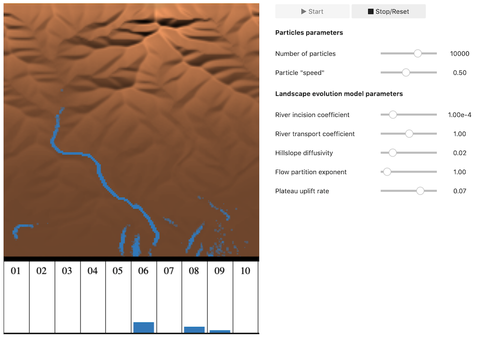

# Gilbert Board

A demonstration of Fastscape in an interactive GUI.

| Run the notebook | Run the dashboard | Run locally |
| --- | --- | --- |
| [](https://mybinder.org/v2/gh/fastscape-lem/gilbert-board/master) | [](https://mybinder.org/v2/gh/fastscape-lem/gilbert-board/master?urlpath=%2Fvoila%2Frender%2Fgilbert_board.ipynb) | See below |



## Install and run it locally

Assuming that you have `git` and
[conda](https://conda.io/docs/index.html) installed, you just need to
run the following commands to install and activate the environment:

```
   $ git clone https://github.com/fastscape-lem/gilbert-board
   $ cd gilbert-board
   $ conda env create -f environment.yml
   $ conda activate gilbert-board
```

Then run the command below to start the notebook server. It should open
a new tab in your browser.

```
    $ jupyter notebook
```

Alternatively, you can run the `voilà` dashboard:

```
    $ voila gilbert_board.ipynb
```
